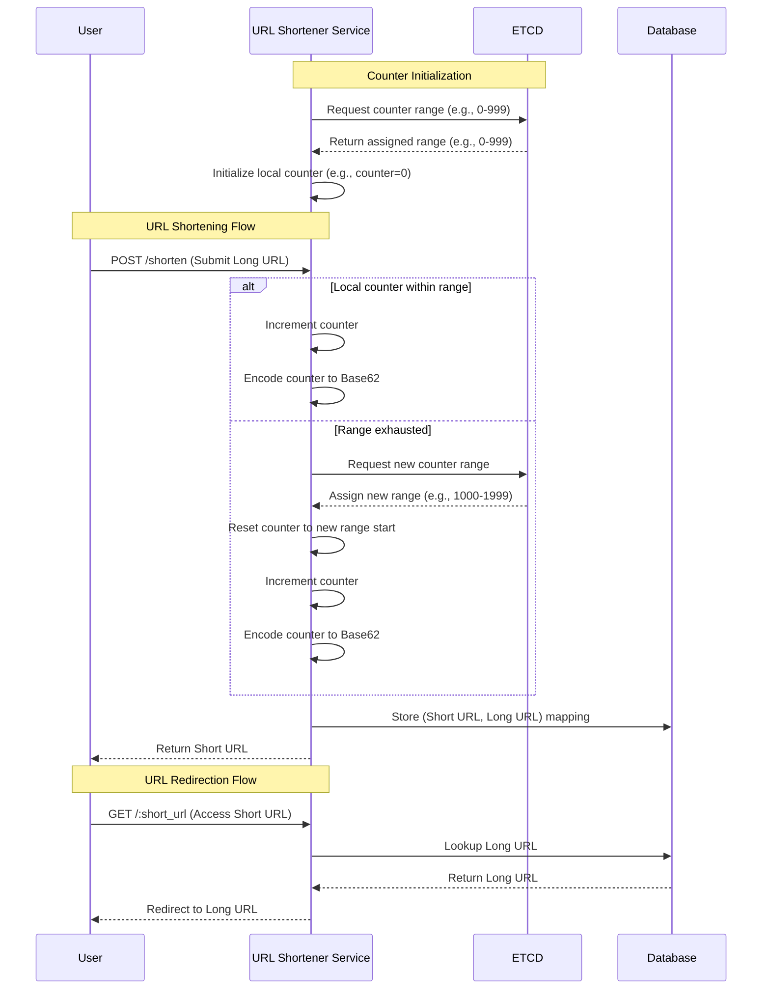

# Scalable URL Shortner

This repo addresses the challenges involved in building a distributed, scalable, and efficient url shortener. A url shortener converts long URLs into short URLs.

## Problem Statement

Building a reliable and scalable URL shortener involves addressing the following challenges:

- **Unique Identifier Generation**: Ensuring that each short URL is unique across all instances.
- **Scalability**: Efficiently handling high traffic across multiple servers.
- **Consistency**: Avoiding conflicts or duplicate identifiers in distributed environments.
- **Low Latency**: Minimizing the time needed to create or resolve short URLs.
- **Compact Identifiers**: Generating short, user-friendly links for easy sharing.

## How It Works



## Solution

This repository uses a combination of distributed coordination, local caching, and compact encoding to address these challenges:

### Distributed Unique Identifier Generation
- **ETCD** is used to allocate unique identifier ranges to each service instance.
- Each instance reserves a block of identifiers (e.g., 1000 numbers) using ETCD's atomic transactions, ensuring no overlap between instances.

### Efficient Local Counter Management
- Once an identifier range is allocated, the instance uses it locally, avoiding repeated ETCD interactions.
- This significantly reduces latency and improves performance.

### Base62 Encoding
- Numeric identifiers are encoded in **Base62** (using `0-9`, `a-z`, and `A-Z`) to create short, compact, and URL-friendly identifiers.

### Thread Safety
- A **mutex (lock)** ensures thread-safe access to the counter within each instance, avoiding race conditions in multi-threaded environments.

### Scalability and Fault Tolerance
- By reserving identifier ranges in blocks, the system minimizes contention with ETCD and supports horizontal scaling.
- If an instance crashes, unused identifiers in its range are safely handled during the next ETCD allocation.

## Why Falcon Over Puma?

This repository uses **Falcon** as the application server due to its superior performance and scalability compared to Puma:

- **Event-Driven Architecture**: Falcon uses non-blocking I/O, ideal for handling high traffic and external calls to ETCD or databases.
- **Efficient Resource Utilization**: Falcon avoids thread overhead, reducing memory usage and improving latency.

### **Comparison in Action**

To see the numbers for yourself, check the results in the [Load Testing Directory](https://github.com/taman9333/scalable_url_shortener/tree/master/load_test). This comparison demonstrates:

- **Falcon vs. Puma** under load testing.
- Falcon's ability to handle significantly higher requests per second (RPS) with lower latency.
- A side-by-side analysis of resource utilization and performance under heavy traffic.

## Installation
URL shortener service is implemented using [Sinatra](https://github.com/sinatra/sinatra), [MongoDB](https://www.mongodb.com/) & [etcd](https://etcd.io/).

To run app locally you have to use [Docker Compose](https://docs.docker.com/compose/).

```bash
docker-compose up url-shortener-1 # first instance runs on Port 9292
docker-compose up url-shortener-2 # second instance runs on Port 9293
```

Those commands will also run a 3-Node etcd Cluster, and MongoDB.

## Shorten a url using curl command

You can send requests to either first instance(port 9292) or second instance(port 9293) to shorten a url

```bash
curl -X POST localhost:9292/shorten -H "Content-Type: application/json" -d '{"url": "http://test1.com"}' # shorten the url using first instance
curl -X POST localhost:9293/shorten -H "Content-Type: application/json" -d '{"url": "http://test2.com"}' # shorten the url using second instance
```

## Load Testing

To run load testing for the URL shortener service, navigate to the load testing directory in the repository:  
[Load Testing Scripts](https://github.com/taman9333/scalable_url_shortener/tree/master/load_test)

The load testing scripts evaluate the performance of:
1. **Single Server Instance:** Testing throughput and latency with one server.
2. **Two Server Instances:** Testing two servers running concurrently to ensure proper coordination when obtaining counter ranges from etcd.

Refer to the `README.md` in the load testing directory for detailed instructions on running the tests and interpreting the results.